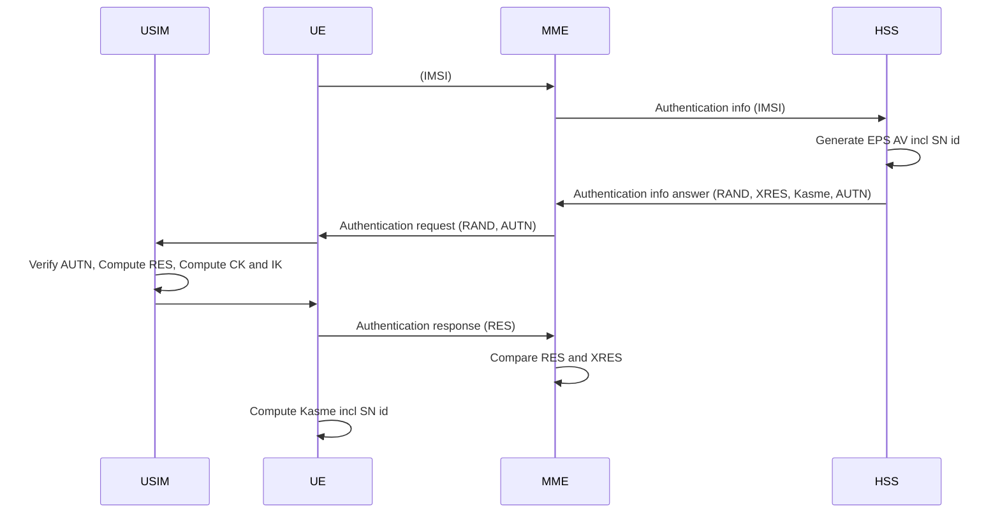
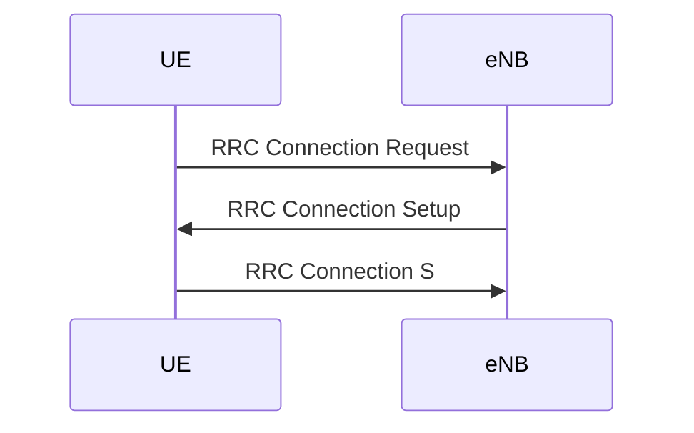

# ARM

---
---

## Cours Sécurité des Réseaux Céllulaires

---

### Notions de base

* Authentification : vérifier la légitimité d'Accès
* Confidentialité : données chiffrées
* Intégrité : information non altérée

Les clés symétriques nécessitent plus de ressources pour être cassées et sont beaucoup plus rapide, le problème du chiffrement symétriqque est la distribution des clés.

Il y a 2 type de chiffrement symétrique :
* Par bloc, chiffrement symétrique classique
* Par flot, on génère une suite de nombre aléatoire puis on fait un ou exclusif avec les données, ce chiffrement est plus rapide mais plus vulnérable au attaques statistiques

### GSM

EIR : Registre qui contient la liste des IMEI (liste des mobiles)

Principale vulnérabilité à cause des réseau sans fils. Plusieurs besoin :
* Confidentialité de l'IMSI
* Authentification
* Confidentialité des données
* Intégrité

En GSM on assure :
* La gestion des équipement volés
* Identité temporaire (TMSI) à la place de l'IMSI
* **Authentification**
* **Chiffrement**

#### Authentification

* la carte sim nous identifie avec une clé primaire unique (Ki = 128 bits) qui ne sort jamais de la sim. On retrouve cette clé dans le AUC associé au IMSI.
* Le mobile envoie son IMSI ou TMSI s'il en a un
* Le MSCS/VLR fait la correspondance TMSI/IMSI il demande au mobile de répondre à un problème avec sa clé Ki. On génère un RAND qu'on "hach" on obtient XRES avec cette valeur et la clé Ki on calcul une clé Kc on envoie le RAND jusqu'à la carte sim qui va calculer un SRES et recalculé un Kc avec sa clé Ki si l'utilisateur est authentique les Kc sont les mêmes.
* La clé Kc est utiliser ensuite comme clé symétrique

L'authentification est régulierement déclanché par le réseau.

#### Limites

* Les transmission sont seulement crypté entre MS et BTS 
* L'authentification est faite dans un seul sens (BTS malvaillante)
* GSM n'assure pas l'intégrité des messages
* Les algorithmes de chiffrement (A5/1 et A5/2) sont faibles brute force de 2^64 facile avec les moyens d'aujourd'hui (permet d'avoir la clé de session uniquement)

### UMTS

* Authentification mutuel
* Intégrité des messages
* Chiffrement
* Meilleur algorithme pour la confidentialité et l'intégrité

---

## TP LTE

---
#### Question 1.1 :
Les algorithme supportés sont listés dans le message ATTACH_REQUEST, les algorithmes sont :
* EEA0 (encryption)
* 128-EEA1 (encryption)
* 128-EEA2 (encryption)
* EIA0 (integrity)
* 128-EIA1 (integrity)
* 128-EIA2 (integrity)

#### Question 1.2 :
Les vecteurs RAND et AUTN sont transmis avec le message AUTHENTICATION_REQUEST

#### Question 1.3 :

#### Question 1.4-1.6 :
L'UE choisi l'antenne à laquelle il s'associe car c'est un scénario ou l'UE arrive dans le réseau (démarrage), il choisi l'antenne qui lui fournis le meilleur signal.

#### Question 1.7:

<!--stackedit_data:
eyJoaXN0b3J5IjpbLTE5NDMzNzEzNDldfQ==
-->