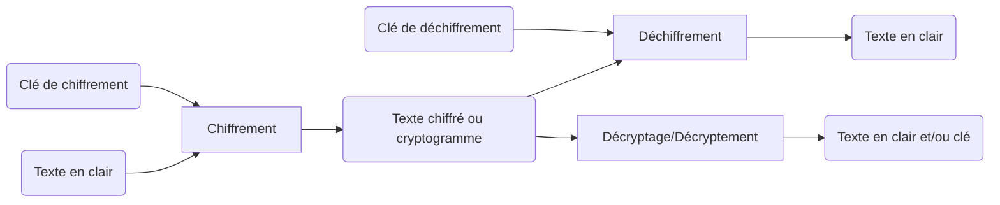
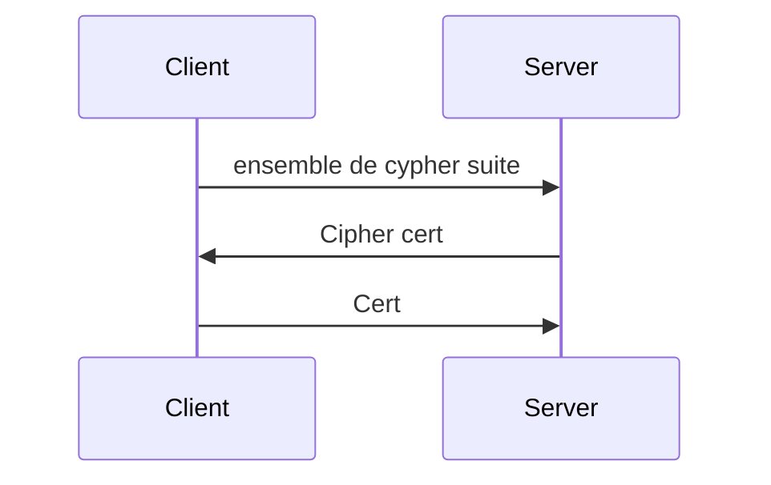

# CSC :  Cryptographie et Sécurité des Communications
---

---
## Introduction
---
### Généralités

#### Qu'est ce que cela évoque ?
* **Des protocoles** (TLS, HTTPS, PGP, SMIME)
* **Des algorithmes** (RSA, AES, Diffie-Hellman)
* **Des usages** ayant des niveau de QoS différents (GSM, chat, VoIP, web)
* **Des applications** 
	* Signal de la NSA
	* Telegram développé par des russes, crée des "*polémiques*" car des terroristes l'utilisent pour avoir des communications chiffrés de bout en bout.
	* TOR
* **Des propriétés** 
	* confidentialité
	*  intégrité
	* non-répudiation, l'impossibilité de remettre en cause un contrat signé
	* déni plausible
	* forward secrecy, l'utilisation de clés éphémères dérivées de clés maîtresses pour chiffrer les messages. On utilise de nouvelles clés éphémères régulièrement. Voler les clés maîtresses ne permettra pas de déchiffrer les messages émis via les clés éphémères.

#### Usagers de la Cryptographie
* Les banques, le e-commerce, les CB
* Les militaires, les états (Telegram en France)
* Les civiles
* Les terroristes, les pédophiles
* Les lanceurs d'alertes
* Les populations surveillés, les dictatures

C'est une réaction à la surveillance des états/des attaquants, devenue trop facile. Le monde numérique a rendu l'observation d'une personne trop facile, disproportion entre le coût pour le surveillant et la quantité de données en sortie. Il y a clairement un *effet Snowden*

### Histoire

De tous temps, depuis l'antiquité, il y a eu des communications secrètes sur des canaux non sûrs. L'historique est militaire évidemment, d'où la culture du secret sur ce que l'on sait faire/ce que l'on sait casser.
#### L'antiquité
Les grecques entre le X^e^ et le VII^e^ siècle av. J.-C. utilisaient un bâton appelé **scytale** autour duquel ils enroulaient une bande de cuir sur laquelle ils écrivaient le message, une fois déroulé les lettres du messages se retrouvaient mélangés.
Nabuchodonosor, roi de Babylone au VII^e^ siècle av. J.-C. rasait le crane des ses messagers pour y cacher les messages, c'est un procédé de sténographie
Les Hébreux au V^e^ siècle av. J.-C. utilisaient une méthode de **substitution alphabétique** inversé, A devient Z, B devient Y, ect.
Le **code César** utilisé par les Romains au I^er^ siècle av. J.-C. est une méthode de **substitution mono-alphabétique** qui consiste à "décaler" les lettre de l'alphabet par un nombre n qui est la clé. 
Le **carré de Polybe** c'est un système de transmission basé sur un carré de 25 cases on peut agrandir ce carré à 36 cases, afin de pouvoir ajouter les chiffres ou pour chiffrer des alphabets comportant davantage de lettres, comme l'alphabet cyrillique. En français, on supprime le  *W*, qui sera remplacé par  *V*. Il existe une variante où ce sont  *I* et  *J*  qui se partagent la même case. Chaque lettre peut être ainsi représentée par un groupe de deux chiffres : celui de sa ligne et celui de sa colonne. Ainsi  *a*=(1;1)  *b*=(1;2), ect. Ce système est apprécié car il permet de convertir les lettres en chiffres, de réduire le nombre de symboles et de représenter chaque lettre par 2 éléments séparés. Il est possible d'ajouter un mot de passe auquel cas on commence à remplir le carré par le mot de passe en éliminant les doublons puis on fini de remplir le carré avec les lettres restantes.
#### Moyen âge
Au IX^e^ siècle un savant arabe décrit **l'analyse des fréquences**  des lettres du chiffré pouvant permettre de décrypter les messages associés aux chiffrements par substitution mono-alphabétique comme le code César.
Au XV^e^ siècle un Égyptien expose les connaissances de la civilisation arabe dans le domaine de la cryptologie dans une encyclopédie en 14 volumes. Un savant Italien expose pour la première fois le chiffrement par **substitution poly-alphabétique** qu'il applique à l'aide d'un disque à chiffrer, cette méthode rend la cryptanalyse par analyse de fréquence inefficace. C'est aussi à cette période qu'est présenté pour la première fois le sur-chiffrement codique (chiffrement d'un message déjà chiffré).
Au XVI^e^ siècle un moine bénédictin expose un procédé sténographique consistant à remplacer chaque lettre par un groupe de mots, le texte ressemble alors à un poème.
Le **chiffre de Vigenère** est une méthode de chiffrement par substitution poly-alphabétique présenté par un diplomate français au XVI^e^ siècle. Le chiffrement utilise une clé littérale ou mot de passe, dont chaque lettre indique le décalage alphabétique à appliquer sur le texte en clair. On reporte les lettres de l'alphabet sur une grille de 26 x 26 cases ; la première rangée contenant  *A*,  *B*, ect. Les colonnes suivantes sont chacune décalées d'une position par rapport à la précédente. Le texte chiffré s'obtient en prenant l'intersection, de la ligne qui commence par la lettre à coder, avec la colonne qui commence par la première lettre du mot de passe, et ainsi de suite. Dès que l'on atteint la fin du mot de passe, on recommence à la première lettre. Pour décoder, il suffit de faire la même chose dans l'autre sens. Cet algorithme de cryptographie comporte beaucoup de points forts. Il est très facile d'utilisation, et le déchiffrement est tout aussi facile si on connaît la clé. La grande caractéristique du _chiffre de Vigenère_ est qu'il est impossible par une analyse statistique simple de retrouver où sont certaines lettres. Un autre avantage réside dans le fait que l'on peut produire une infinité de clés.
**Exemple**

message|b|o|n|a|n|n|i|v|e|r|s|a|i|r|e
--|--|--|--|--|--|--|--|--|--|--|--|--|--|--|--
mdp|v|i|g|e|n|e|r|e|v|i|g|e|n|e|r
substitution|w|w|t|e|a|r|z|z|z|z|y|e|v|v|v
Avec le mot de passe vigenere, sur le message "bon anniversaire" on obtient wwt earzzzzyevvv
Au XVII^e^ siècle une technique qui consiste à représenter chaque lettre du message par un groupe de 5 lettre *A* ou *B* est développé, le chiffré est ainsi une succession de ces 2 lettres, ce procédé est équivalent à un codage binaire de l'alphabet sur 5 bits préfigurant le codage numérique sur 8 bits utilisé en informatique (ASCII).
Au XIX^e^ siècle les moyens de transmissions sont utilisés avec un moyen de codage (télégraphe de Chappe). Le **chiffrement de [Playfair](https://fr.wikipedia.org/wiki/Chiffre_de_Playfair)** est inventé. Un Hollandais  expose les règles à respecter pour concevoir un bon système cryptographique, toujours valable actuellement, la principale est la suivante : la sécurité d'un système ne doit pas reposer sur le secret de la méthode de chiffrement.
#### Première Guerre mondiale
Elle marque la victoire de la cryptanalyse face à la cryptographie. La maîtrise de la cryptanalyse aide à décrypter les messages des ennemis et donne aux alliés un avantage important dés le début du conflit. Le décryptage s'est ainsi révélé déterminant, accélérant l'entré en guerre des Etats-Unis. La rapidité des transmissions a bénéficié des progrès du  XIX^e^ siècle, et est désormais instantanée, mais le déchiffrage des messages chiffrés, réalisé à la main, reste très lent, nécessitant souvent plusieurs heures. Le chiffrement/déchiffrement entièrement manuel est donc susceptible d'être erroné. Il doit être relativement simple et rapide à appliquer (une heure environ) pour transmettre les informations à temps et éviter les erreurs de codage dues au stress du champ de bataille. Les chiffres utilisés n'assurent donc pas un niveau satisfaisant de sécurité mais aujourd'hui avec l'informatique, le recours aux machines permet de dire qu'on est entré, avec la cryptologie, dans l'ère de la science.
#### Seconde Guerre mondiale
La cryptologie a joué un rôle décisif pendant la Seconde Guerre mondiale. Les exploits des alliés en matière de cryptanalyse auraient permis d'écourter la guerre (de un à deux ans, selon certains spécialistes). Notamment grâce aux décryptage des messages de la machine **[Enigma](https://fr.wikipedia.org/wiki/Enigma_(machine))**, le chiffre Enigma n'a jamais été cassé, ce sont des attaques par force brute qui ont permis certains jours de connaitre certaines clé. Les Allemands utilisaient aussi le chiffre de Lorenz qui a lui été cassé.
#### Cryptologie moderne
Claude Shannon a beaucoup travailler après la guerre sur la cryptologie notamment l'aspect mathématique. Il défini les 2 principaux objectifs :
* Le secret
* L'authentification
L'informatique a permis 3 avancés majeures publiques (non secrète et non contrôlées par les services de renseignements) :
* Le développement d'un standard publique de chiffrement
* Le développement de l'échange de **clés Diffie-Hellman**
* Le développement du chiffrement asymétrique
Ils ont aussi permis de développer des fonctions de hachage cryptographique. Cela permet de vérifier l'intégrité d'un message reçu en comparant le hach de ce message avec le hach produit à l'envoi. Les fonctions de hachages servent aussi à vérifier un mot de passe sans en garder une copie.

### Cryptographie et sécurité hardware/software
Qu'est-ce que la sécurité des communications ?

-   Sécurité du canal de transmission -> cryptographie
-   Sécurité de l'implémentation -> cryptographie/son déploiement
-   Sécurité du logiciel et du matériel. C'est en général les deux derniers éléments qui pourront être attaqués.

Attention, les communications ne sont pas que numériques, la cryptographie n'est qu'une partie de la solution. La sécurité des communications, plus globalement, relève de l'*OPSEC*, la sécurité opérationnelle, qui englobe toutes les méthodes allant du filtre écran dans le TGV (voire le non-travail dans le TGV) aux bonnes pratiques de mise à jour de logiciels en passant par la sécurité physique des terminaux nomades (pas altérés, pas laissés sans surveillance, etc.) L'utilisation de cryptographie forte n'est donc pas une garantie de non-observabilité (quitte à ce que cela demande des moyens qui peuvent aller à la pose de micros/caméras, comme depuis relativement longtemps).

De la même façon, l'absence/l'interdiction de crypto n'empêche pas d'avoir des communications secrètes. Autrement dit, en interdisant la crypto, les mécréants sauront toujours communiquer de manière (à peu près) sûre.

La cryptographie nous ramène, plus ou moins, à un niveau de sécurité des communications pré-monde numérique : écoute à grande échelle trop chère (?), écoute ciblée possible.

---
---
## Bases de la crypto
---
### Terminologie

Cryptologie = cryptographie + cryptanalyse
La cryptographie est l'étude des méthodes permettant de transmettre des données de manière confidentielle.
La cryptanalyse est à l'inverse l'étude des procédés cryptographique dans le but de trouver des faiblesses, et en particulier de décrypter des messages chiffrés. Le décryptage/décryptement est l'action qui consiste à trouver le message en clair sans connaitre la clé.

### Chiffrement Symétrique
Les clés de chiffrement et de déchiffrement sont identiques, la clé doit donc être secrète et connu uniquement des tiers communiquants.
Il y a 2 types d'algorithmes :
#### Chiffrement en continu (Stream Cipher)
Agit sur un bit à la fois, le plus courant actuellement est RC4 qui a une longueur de clé variable souvent 128 bits.
#### Chiffrement par blocs (Block Cipher)
Opère sur des blocs du texte en clair souvent 64 bits, il y a beaucoup d'algorithmes certains ayant évoluer pour arriver à AES qui est le plus utilisé.

### Chiffrement Asymétrique
Avec le chiffrement asymétrique, les clés de chiffrement et de déchiffrement sont distinct et ne peuvent être déduite l'une de l'autre. On a donc un clé publique et une clé privée, la clé publique sert à chiffrer un message que seul celui qui aura la clé privée pourra déchiffrer. En chiffrant avec la clé privée n'importe qui peut lire le message grâce à la clé publique, ce procédé sert pour signer des messages.

---
---
## TD4 Autorités de certification
---
### Qu'est ce qu'une CA ?

#### 1. Informations du certificat

La CA a une paire de clé publique/privée avec lesquels elle va monter son certificat.

* Les certificats de l'autorité de certification contiennent l'identité de l'autorité de certification, la date de validité du certificat, "identité", la clé publique de l'autorité de certification. Ce certificat est signé avec la clé privée du CA donc lié à la clé publique qu'il contient.
* Les certificats des sites contiennent l'identité du site, hostname (CNAME), la date de validité du certificat, l'identité de l'autorité de certification, clé publique du site. Ce certificat est signé par le CA avec sa clé privée.

#### 2. Validité du certificat

Pour vérifier la validité d'un certificat :
* Vérifier la signature du CA
* vérifier la date de validité
* vérifier que le CNAME correspond au hostname de l'url

Il est prérequis d'avoir au préalable enregistré le certificat de la CA.

---
### Organisation d'une CA à étage
CA|Site|Client
:--:|:--:|:--:
Pub~CALong~ / Priv~CALong~ / {Cert~CALong~}^PrivCALong^|Pub~Site~ / Priv~Site~ / {Cert~Site~}Priv~CACourte~|Cert~CALong~
Pub~CACourte~ / Priv~CACourte~ / {Cert~CACourte~}^PrivCALong^||

---
### Révocation

#### CRL (Certificate Revocation List)

Blacklist des certificats, doit être consulter régulièrement par les clients, il faut ensuite renvoyer cette liste qui fait plusieurs méga à tout les clients ce qui a un coût très élevé, ce n'est donc pas utilisé.

#### OCSP (Online Certificate Status Protocol)

Requète sur la base de donnée des certificats révoqués.

#### Agrafage OCSP

Les serveurs https doivent faire retamponner leurs certificats tout les jours par le CA ainsi seuls les certificats tamponné dans les 24 heures sont valides. Cela permet nottement de diminuer la charge au niveau des CA puisqu'au lieu de répondre à chaque clients demandant un certificat ils tamponnent le certificat d'un serveur une seul fois. Cela permet aussi d'éviter de ralentir le client qui devait demander la validité du certificat.

#### Certificats EV

Ces certificats "premium" ont un  service de révocation fonctionnel avec OCSP que la plus part des autres certificats n'ont pas il sont cependant plus compliqués à obtenir car necessitant quelques documents administratifs.

---
### Compromission

Le mauvais comportement ou l'attaque de l'autorité de certification la plus faible compromet toutes les autres et le système https.

---
---
## TD5 DANE/PGP
---
### Intro Rappel

DNS est une table liant les nom symboliques (de domaines) et les adresses ip des serveurs.
Lorsque l'on veut accéder à un site web (ex www.facebook.com) on regarde d'abord le fichier host local, la plupart du temps les sites n'y sont pas, on passe donc par le serveur DNS configuré qui garde ensuite l'adresse du site dans son cache pendant le TTL ce qui lui permet de contacter directement l'adresse plutôt que de relancer une recherche. DNS ne prévois aucun mécanismes de sécurité, c'est pourquoi DNSSEC est apparu.

---
### DANE

#### Principe simplifié DNSSEC

* ICANN

<Kpub, Kpr>

.|DNSKey|Kpub
--|--|--
fr|NS|ns.fr
ns.fr|A|@IP
fr|DS|h(K'pub)
fr|RRSIG|Sig(h(K'pub))~Kpr~

* AFNIC

<K'pub, K'pr>

.fr|DNSKey|K'pub
--|--|--
insa-lyon.fr|NS|ns.insa-ly.fr
ns.insa-ly.fr|A|@IP
insa-lyon|DS|h(K''pub)
insa-lyon|RRSIG|Sig(h(K''pub))~K'pr~

* INSA

<K''pub, K''pr>

insa-lyon|DNSKey|K''pub
--|--|--
insa-lyon|MX|mail.insa-ly
mail|A|@IPmail
(E1) www|A|@IP
www|RRSIG A|Sig(E1)~K''pr~

Modification ou ajout d'un enregistrement à insa-lyon.fr :

ex: depart-numerique.insalyon.fr

Aucun impact sur les autres zones, il faut seulement ajouter/ modifier l'enregitrement en question et resigner cet enregistrement.

Si changement de clé de insa-lyon, resigner tout les enregitrement et changement de la signature de notre clé publique au niveau de la zone parente.

---
---

## Cours 

