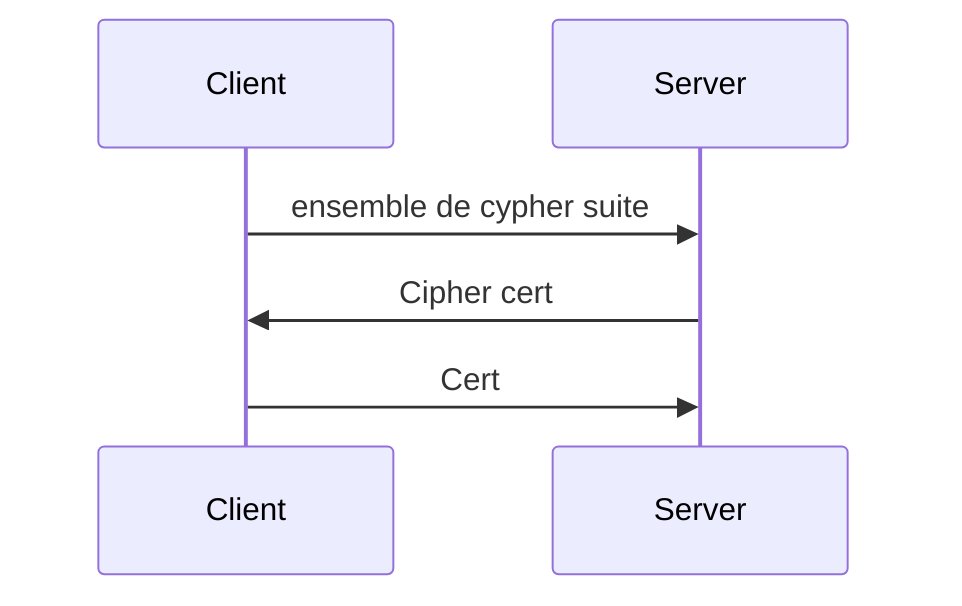

# CSC
---

---
## TD4 Autorités de certification
---
### Qu'est ce qu'une CA ?

#### 1. Informations du certificat

La CA a une paire de clé publique/privée avec lesquels elle va monter son certificat.

* Les certificats de l'autorité de certification contiennent l'identité de l'autorité de certification, la date de validité du certificat, "identité", la clé publique de l'autorité de certification. Ce certificat est signé avec la clé privée du CA donc lié à la clé publique qu'il contient.
* Les certificats des sites contiennent l'identité du site, hostname (CNAME), la date de validité du certificat, l'identité de l'autorité de certification, clé publique du site. Ce certificat est signé par le CA avec sa clé privée.

#### 2. Validité du certificat

Pour vérifier la validité d'un certificat :
* Vérifier la signature du CA
* vérifier la date de validité
* vérifier que le CNAME correspond au hostname de l'url

Il est prérequis d'avoir au préalable enregistré le certificat de la CA.

---
### Organisation d'une CA à étage
CA|Site|Client
:--:|:--:|:--:
PubCALong / PrivCALong / {CertCALong}PrivCALong|PubSite / PrivSite / {CertSite}PrivCACourte|CertCALong
PubCACourte / PrivCACourte / {CertCACourte}PrivCALong||

---
### Révocation

#### CRL (Certificate Revocation List)

Blacklist des certificats, doit être consulter régulièrement par les clients, il faut ensuite renvoyer cette liste qui fait plusieurs méga à tout les clients ce qui a un coût très élevé, ce n'est donc pas utilisé.

#### OCSP (Online Certificate Status Protocol)

Requète sur la base de donnée des certificats révoqués.

#### Agrafage OCSP

Les serveurs https doivent faire retamponner leurs certificats tout les jours par le CA ainsi seuls les certificats tamponné dans les 24 heures sont valides. Cela permet nottement de diminuer la charge au niveau des CA puisqu'au lieu de répondre à chaque clients demandant un certificat ils tamponnent le certificat d'un serveur une seul fois. Cela permet aussi d'éviter de ralentir le client qui devait demander la validité du certificat.

#### Certificats EV

Ces certificats "premium" ont un  service de révocation fonctionnel avec OCSP que la plus part des autres certificats n'ont pas il sont cependant plus compliqués à obtenir car necessitant quelques documents administratifs.

---
### Compromission

Le mauvais comportement ou l'attaque de l'autorité de certification la plus faible compromet toutes les autres et le système https.

---
---
## TD5 DANE/PGP
---
### Intro Rappel

DNS est une table liant les nom symboliques (de domaines) et les adresses ip des serveurs.
Lorsque l'on veut accéder à un site web (ex www.facebook.com) on regarde d'abord le fichier host local, la plupart du temps les sites n'y sont pas, on passe donc par le serveur DNS configuré qui garde ensuite l'adresse du site dans son cache pendant le TTL ce qui lui permet de contacter directement l'adresse plutôt que de relancer une recherche. DNS ne prévois aucun mécanismes de sécurité, c'est pourquoi DNSSEC est apparu.

---
### DANE

#### Principe simplifié DNSSEC

* ICANN

<Kpub, Kpr>

.|DNSKey|Kpub
--|--|--
fr|NS|ns.fr
ns.fr|A|@IP
fr|DS|h(K'pub)
fr|RRSIG|Sig(h(K'pub))~Kpr~

* AFNIC

<K'pub, K'pr>

.fr|DNSKey|K'pub
--|--|--
insa-lyon.fr|NS|ns.insa-ly.fr
ns.insa-ly.fr|A|@IP
insa-lyon|DS|h(K''pub)
insa-lyon|RRSIG|Sig(h(K''pub))~K'pr~

* INSA

<K''pub, K''pr>

insa-lyon|DNSKey|K''pub
--|--|--
insa-lyon|MX|mail.insa-ly
mail|A|@IPmail
(E1) www|A|@IP
www|RRSIG A|Sig(E1)~K''pr~

Modification ou ajout d'un enregistrement à insa-lyon.fr :

ex: depart-numerique.insalyon.fr

Aucun impact sur les autres zones, il faut seulement ajouter/ modifier l'enregitrement en question et resigner cet enregistrement.

Si changement de clé de insa-lyon, resigner tout les enregitrement et changement de la signature de notre clé publique au niveau de la zone parente.

---
---

## Cours 

